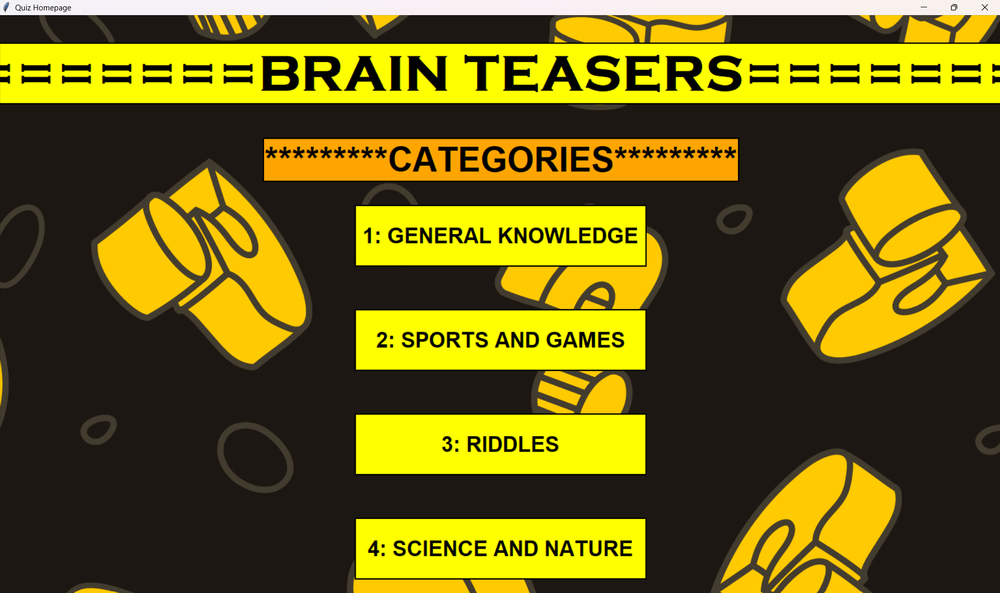
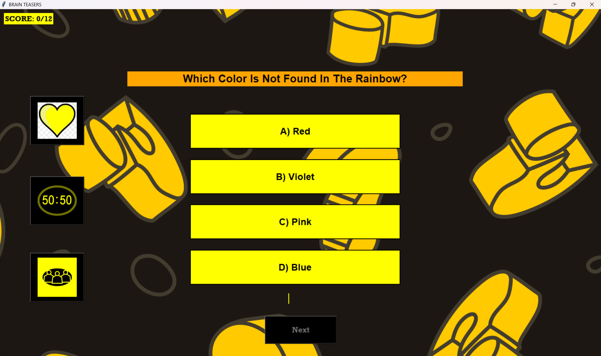
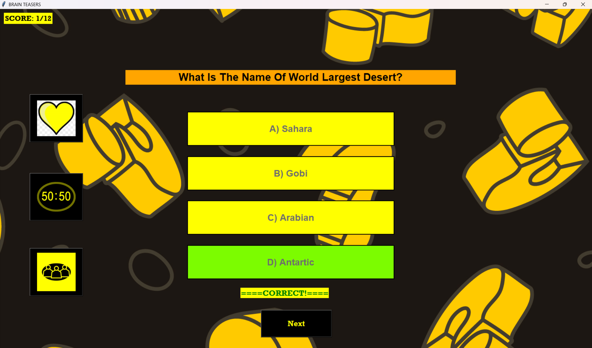
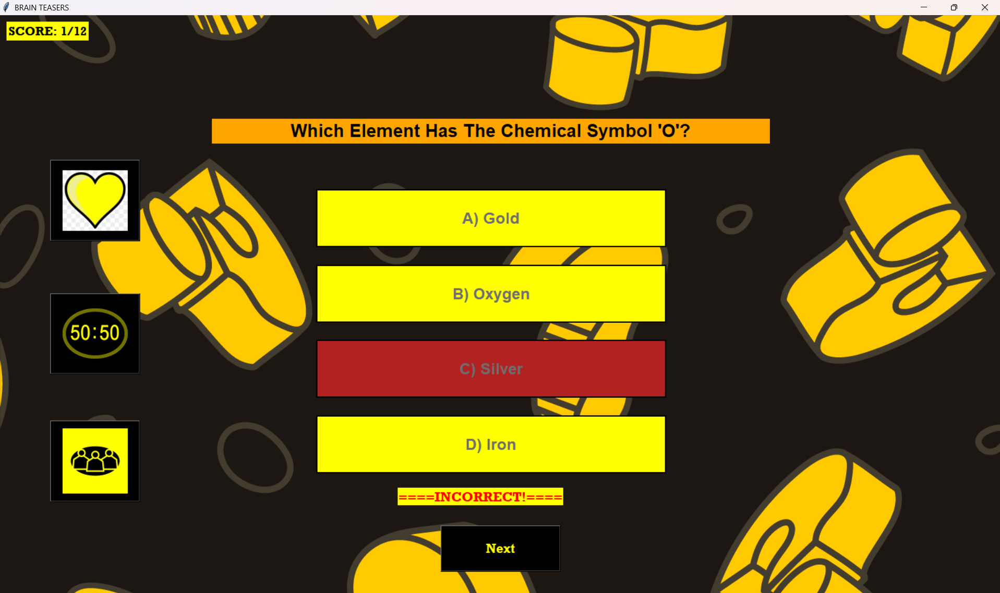
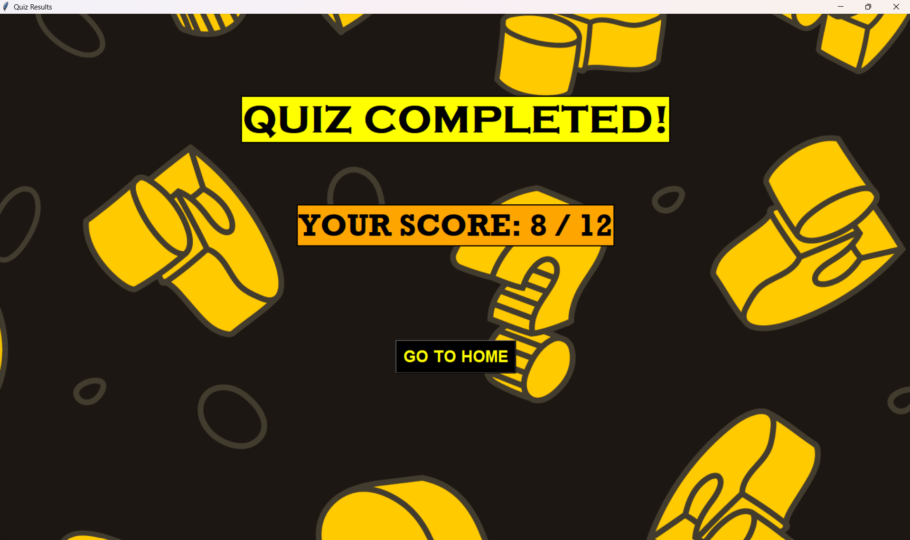

<!-- # 🧠 Brain Teasers - Quiz Game

A desktop-based quiz application developed in **Python** using **Tkinter**. The application provides an interactive graphical interface where users can test their knowledge across multiple categories while using exciting lifelines inspired by popular quiz shows.

---

## 📖 Overview

**Brain Teasers** is a GUI-based quiz game that allows users to choose from different quiz categories and answer multiple-choice questions. The application keeps track of the user's score, provides instant feedback after every answer, and includes three interactive lifelines to make gameplay more engaging.

The project was developed as a first-semester Python project to demonstrate programming concepts such as GUI development, data structures, functions, event-driven programming, and file organization.

---

## ✨ Features

- Interactive Graphical User Interface (GUI)
- Four quiz categories
- Multiple-choice questions
- Real-time score tracking
- Instant answer validation
- Final score/result screen
- Three lifelines:
  - ❤️ Extra Life
  - 50:50
  - 👥 Ask the Audience
- Attractive background and image-based interface
- Easy navigation between home screen and quiz screen

---

## 📚 Quiz Categories

The application currently includes four categories:

- 🌍 General Knowledge
- 🔬 Science and Nature
- ⚽ Sports and Games
- 🧩 Riddles

Each category contains **12 carefully selected questions**.

---

## ❤️ Lifelines

### ❤️ Extra Life

Disables three incorrect options, leaving only the correct answer available.

### 50:50

Removes two incorrect options, increasing the chance of selecting the correct answer.

### 👥 Ask the Audience

Displays audience voting percentages using vertical progress bars. The correct answer receives the highest simulated audience vote.

Each lifeline can only be used **once per quiz**.

---

## 🛠 Technologies Used

- Python 3
- Tkinter
- Pillow (PIL)
- Random Module

---

## 📁 Project Structure

```
Brain-Teasers/
│
├── main.py
├── README.md
├── requirements.txt
│
└── images/
    ├── HOMEBACKGROUND.PNG
    ├── yellow_heart.png
    ├── yellow_heart_with_cross.png
    ├── yellow_50.png
    ├── yellow_fifty_cross.png
    ├── yellow_audience.png
    └── audience_cross.png
```

---

## 🚀 Installation

### 1. Clone the repository

```bash
git clone https://github.com/your-username/Brain-Teasers.git
```

### 2. Navigate into the project

```bash
cd Brain-Teasers
```

### 3. Install the required package

```bash
pip install pillow
```

---

## ▶️ Running the Project

Run the application using:

```bash
python main.py
```

---

## 🎮 How to Play

1. Launch the application.
2. Select a quiz category.
3. Read each question carefully.
4. Click the option you think is correct.
5. Receive immediate feedback.
6. Use lifelines whenever needed.
7. Complete all questions.
8. View your final score on the results screen.

---

## 🧩 Programming Concepts Used

This project demonstrates:

- Lists
- Dictionaries
- Functions
- Conditional Statements
- Loops
- Randomization
- Event Handling
- GUI Programming
- Image Processing
- Global Variables
- Tkinter Widgets
- Object References

---

## 📷 Screenshots

### Home Screen

*(Add a screenshot here.)*

### Quiz Screen

*(Add a screenshot here.)*

### Result Screen

*(Add a screenshot here.)*

---

## 🔮 Future Improvements

Some features planned for future versions include:

- Difficulty Levels
- Countdown Timer
- Leaderboard
- Player Login
- Database Integration
- Sound Effects
- Animated Transitions
- More Quiz Categories
- Question Randomization
- Save High Scores

---

## 🐞 Known Limitations

- Questions are stored directly inside the Python file.
- Scores are not saved after closing the application.
- Lifelines can only be used once per quiz session.
- No multiplayer functionality.

---

## 📦 Requirements

- Python 3.10 or above
- Pillow

Install dependencies:

```bash
pip install pillow
```

---

## 👨‍💻 Author

**Your Name**

First Semester Project

Python Programming

---

## 📄 License

This project was developed for educational purposes as part of a university semester project.

Feel free to use, modify, and improve the project for learning purposes.

---

## ⭐ Acknowledgements

- Python Documentation
- Tkinter Documentation
- Pillow Documentation

Special thanks to our instructor for guidance throughout the project. -->


# Brain Teasers - Interactive Quiz Game

A desktop-based interactive quiz application developed in Python using Tkinter. The application offers multiple quiz categories, a graphical user interface, score tracking, and lifelines inspired by television quiz shows to create an engaging user experience.

---

## Table of Contents

- [Project Overview](#project-overview)
- [Key Features](#key-features)
- [Built With](#built-with)
- [Project Structure](#project-structure)
- [Installation](#installation)
- [Running the Application](#running-the-application)
- [Application Workflow](#application-workflow)
- [Quiz Categories](#quiz-categories)
- [Lifelines](#lifelines)
- [Screenshots](#screenshots)
- [Future Enhancements](#future-enhancements)
- [Author](#author)

---

# Project Overview

**Brain Teasers** is a GUI-based quiz application that allows users to test their knowledge across multiple categories through an intuitive desktop interface.

The project demonstrates the practical implementation of Python programming concepts, including GUI development with Tkinter, event-driven programming, dictionaries, lists, functions, image handling, and randomization.

Players can choose a category, answer multiple-choice questions, use special lifelines during gameplay, and receive their final score upon completion.

---

# Key Features

- Interactive graphical user interface (GUI)
- Four quiz categories
- Multiple-choice questions
- Instant answer validation
- Real-time score tracking
- Final results screen
- Three gameplay lifelines
- Image-based interface
- User-friendly navigation
- Simple and responsive design

---

# Built With

| Technology | Purpose |
|------------|---------|
| Python | Core programming language |
| Tkinter | GUI development |
| Pillow (PIL) | Image handling |
| Random Module | Randomized lifelines and gameplay |

---

# Project Structure

```
Brain-Teasers/
│
├── main.py
├── README.md
├── requirements.txt
│
└── images/
    ├── HOMEBACKGROUND.PNG
    ├── yellow_heart.png
    ├── yellow_heart_with_cross.png
    ├── yellow_50.png
    ├── yellow_fifty_cross.png
    ├── yellow_audience.png
    └── audience_cross.png
```

---

# Installation

## Clone the repository

```bash
git clone https://github.com/yourusername/Brain-Teasers.git
```

## Navigate to the project directory

```bash
cd Brain-Teasers
```

## Install the required dependency

```bash
pip install pillow
```

---

# Running the Application

Execute the following command:

```bash
python main.py
```

---

# Application Workflow

1. Launch the application.
2. Select one of the available quiz categories.
3. Read the displayed question.
4. Choose one of the four available options.
5. Receive immediate feedback indicating whether the answer is correct or incorrect.
6. Use lifelines strategically whenever required.
7. Continue until all questions have been answered.
8. View the final score on the results screen.

---

# Quiz Categories

The application currently contains four categories:

- General Knowledge
- Science and Nature
- Sports and Games
- Riddles

Each category consists of twelve multiple-choice questions.

---

# Lifelines

### ❤️ Extra Life

Eliminates three incorrect options, leaving only the correct answer available.

---

### 50:50

Randomly removes two incorrect options, increasing the probability of selecting the correct answer.

---

### 👥 Ask the Audience

Displays simulated audience voting percentages using progress bars. The correct answer is assigned the highest percentage while the remaining votes are distributed randomly.

Each lifeline is available only once during a quiz session.

---

# Screenshots

## Home Screen

> Add a screenshot of the application's home page here.


---

## Quiz Window

> Add a screenshot showing a quiz question.



>Add a screenshot of the screen where answer is correct

>Add a screenshot of the screen where answer is incorrect

## Results Screen

> Add a screenshot displaying the final score.

---

# Future Enhancements

Possible improvements include:

- Timer-based questions
- Difficulty levels
- Login system
- Database integration
- High-score leaderboard
- Question randomization
- Sound effects
- Dark mode
- Additional quiz categories
- Online multiplayer support

---

# Author

Rameen Siddiqui
Eshaal Faisal

Python Desktop Application

First Semester Project 

---

# License

This project is intended for educational and learning purposes.

Feel free to fork, modify, and improve the project.